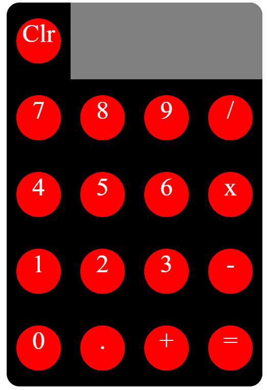

# Calculator
> Objective: Develop a JQuery based calculator
> Live demo [_here_](https://calculator-i4bq1m92l-jayyr2040.vercel.app/). <!-- If you have the project hosted somewhere, include the link here. -->

## Table of Contents
* [General Info](#general-information)
* [Technologies Used](#technologies-used)
* [Features](#features)
* [Screenshots](#screenshots)
* [Setup](#setup)
* [Usage](#usage)
* [Project Status](#project-status)
* [Room for Improvement](#room-for-improvement)
* [Acknowledgements](#acknowledgements)
<!-- * [License](#license) -->

## General Information
- A Javascript app 
<!-- You don't have to answer all the questions - just the ones relevant to your project. -->

## Technologies Used
- jQuery -  Simplifies HTML document traversing, event handling, animating for rapid web development.
- Bootstrap - Extensive list of components and Bundled Javascript plugins.
- Javascript, CSS, html DOM

## Features
List the ready features here:
- Simple, easy to use interface

## Screenshots

<!-- If you have screenshots you'd like to share, include them here. -->

## Setup
Open the index.html in a browser.

## Usage

## Project Status
Project is: _in progress. 

## Room for Improvement
Areas of improvement: Planning is critical for writing a efficient code. Probably need to take more time
to plan.

## Acknowledgements

<!-- Optional -->
<!-- ## License -->
<!-- This project is open source and available under the [... License](). -->
<!-- You don't have to include all sections - just the one's relevant to your project -->